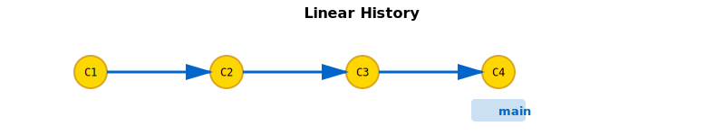
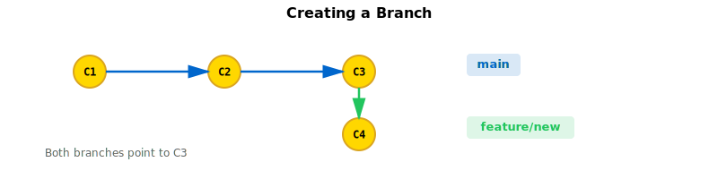
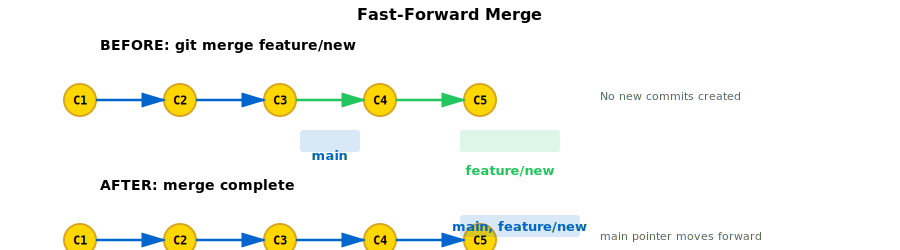
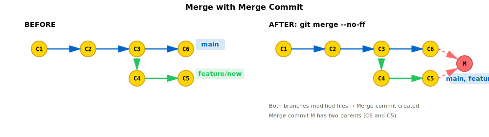
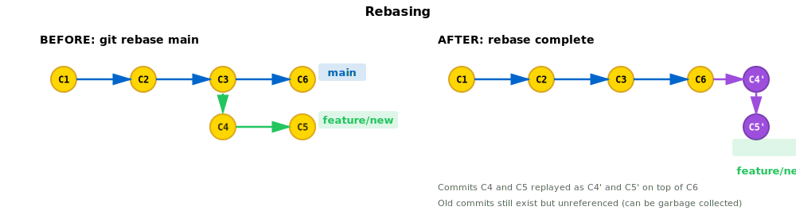
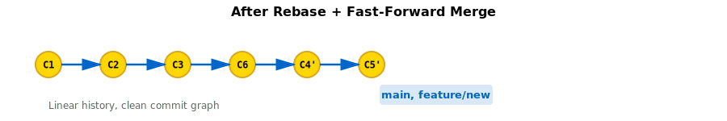
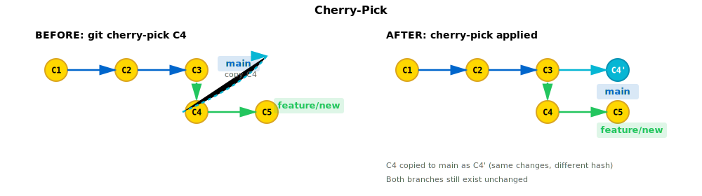
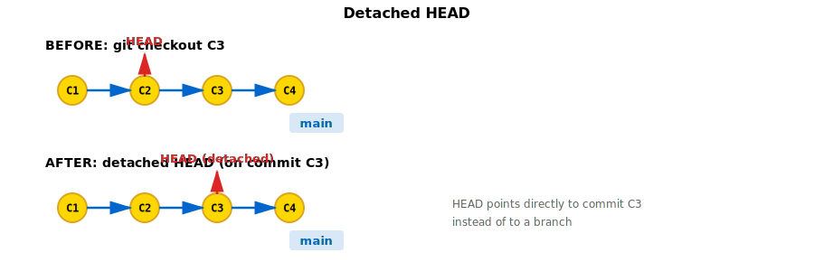
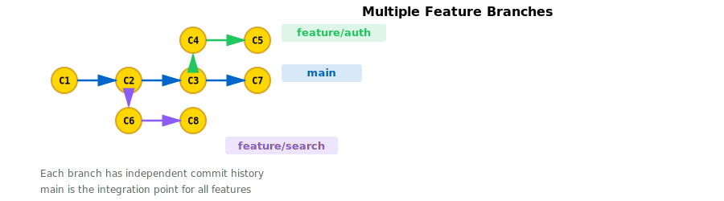

# 9. Visual Guide: Git Tree Progression

See how the commit graph evolves as you perform Git operations.

## Initial Repository

Your first commit creates a single node in the graph:

```
C1 ← main
```

## Linear History

As you commit changes, the chain grows:



## Creating a Branch

When you create a branch, it's just a pointer to the current commit:



Both branches point to C3. When you commit on the branch, it advances while `main` stays behind. The branches have diverged. C3 is their common ancestor.

## Merging (Fast-Forward)

If `main` hasn't changed since you branched, Git can fast-forward:



The `main` branch pointer moves forward to C5. No new commit is created.

## Merging (Non-Fast-Forward)

If `main` has new commits, a merge commit is created:



A merge commit M (shown in red) has two parents: C6 and C5. Both branches now point to M.

## Rebasing

Rebasing replays your commits on top of another branch:



C4 and C5 are replayed as C4' and C5' (shown in purple) on top of C6. They have new hashes because their parent changed. The old C4 and C5 are no longer referenced (can be garbage collected).

### Result After Rebase + Fast-Forward Merge



Linear history, clean commit graph.

## Cherry-Pick

Cherry-pick copies a specific commit onto another branch:



C4 is copied as C4' (new hash, shown in cyan) onto main. Both branches still exist unchanged. The original C4 and C5 remain on the feature branch.

## Detached HEAD

When you checkout a specific commit instead of a branch, HEAD points directly to the commit:



If you make new commits in detached HEAD, they're not on any branch. For example:

```
C1 ← C2 ← C3 ← C4 ← main
     ↑
     C5 ← C6 ← HEAD (detached)
```

If you switch away without creating a branch, C5 and C6 become unreferenced (but recoverable via reflog).

## Multiple Branches

Complex projects often have multiple feature branches:



Each branch has its own commit history. `main` is the integration point.

## Merge Conflicts

When branches modify the same lines, a merge conflict occurs:

```
         C4 ← C5 ← feature/auth
        ↙
C1 ← C2 ← C3 ← C6 ← main
(both modified styles.css)

During merge:
         C4 ← C5 ← feature/auth
        ↙
C1 ← C2 ← C3 ← C6 ← ??? (conflict!)
```

You resolve the conflict manually, then create a merge commit:

```
         C4 ← C5 ← feature/auth
        ↙        ↘
C1 ← C2 ← C3 ← C6 ← M ← main
```

## Undoing Commits (Reset)

Reset moves the branch pointer back:

```
Before: git reset --hard HEAD~2
C1 ← C2 ← C3 ← C4 ← C5 ← main
                          ↑
                        HEAD

After:
C1 ← C2 ← C3 ← main, HEAD
     ↑
(C4 and C5 still exist, just unreferenced)
```

The commits are discarded from the branch perspective but recoverable via reflog.

## Reverting Commits

Revert creates a new commit that undoes a previous one:

```
Before: git revert C3
C1 ← C2 ← C3 ← C4 ← C5 ← main

After:
C1 ← C2 ← C3 ← C4 ← C5 ← R ← main
(R's changes are the opposite of C3)
```

The original commits stay in history. R is a normal new commit.

## Amending the Last Commit

Amend modifies the most recent commit:

```
Before: git commit --amend
C1 ← C2 ← C3 ← C4 ← main

After:
C1 ← C2 ← C3 ← C4' ← main
(C4 is replaced by C4' with new hash)
```

If C4 hasn't been pushed, only your local history changes. If it's been pushed, you'll need to force-push (dangerous!).

## Push and Fetch

When you push, the remote's commit graph updates:

```
Local:
C1 ← C2 ← C3 ← C4 ← main

Remote (before push):
C1 ← C2 ← main

After: git push origin main
Local:
C1 ← C2 ← C3 ← C4 ← main

Remote:
C1 ← C2 ← C3 ← C4 ← main
```

Both are now synchronized. Remote tracking branches update when you fetch:

```
Local (after fetch):
C1 ← C2 ← C3 ← C4 ← main
          ↑
       origin/main
```

## A Real Workflow

Here's how a typical team workflow evolves:

**1. Start:** Everyone on main
```
C1 ← main, origin/main
```

**2. Alice creates feature/auth:**
```
           C2 ← feature/auth
          ↙
C1 ← main, origin/main
```

**3. Bob creates feature/search:**
```
           C2 ← feature/auth
          ↙
C1 ← main, origin/main
  ↘
   C3 ← feature/search
```

**4. Alice commits:**
```
           C2 ← C4 ← feature/auth
          ↙
C1 ← main, origin/main
  ↘
   C3 ← feature/search
```

**5. Alice's PR is approved, merged to main:**
```
           C2 ← C4 ⟲
          ↙        ↘
C1 ← main, origin/main ← M
  ↘
   C3 ← feature/search
```

**6. Bob fetches and sees main updated:**
```
           C2 ← C4 ⟲
          ↙        ↘
C1 ←  M ← main
↑    ↑
origin/main (before fetch)

After fetch:
           C2 ← C4 ⟲
          ↙        ↘
C1 ← origin/main ← M ← main
  ↘
   C3 ← feature/search
```

**7. Bob rebases feature/search on the updated main:**
```
           C2 ← C4 ⟲
          ↙        ↘
C1 ← origin/main ← M ← main
              ↘
               C3' ← feature/search
```

**8. Bob's PR is approved and merged:**
```
           C2 ← C4 ⟲
          ↙        ↘
C1 ← origin/main ← M ← C3' ⟲
                    ↑    ↘
                   main ← M2
```

And the cycle continues...

## Key Takeaways

- **Commits form a DAG** — Each commit points to its parent(s)
- **Branches are pointers** — Moving a branch pointer doesn't change commits
- **Merges create branches** — Merge commits have multiple parents
- **Rebasing replays commits** — Creates new commits with different hashes
- **History is immutable** — Old commits stay accessible via reflog
- **Conflicts happen when** — Two branches modify the same lines

## Visual Patterns to Remember

```
Linear history:          C1 ← C2 ← C3 ← C4

Branching:               C3 ← C4 ← feature
                        ↙
                       C1 ← C2 ← main

Merging:                C3 ← C4 ⟲
                       ↙        ↘
                       C1 ← C2 ← M ← main

Rebasing:              C1 ← C2 ← C3' ← C4' ← feature
                              ↑
                            main
```

These patterns repeat in every Git workflow. Understanding them helps you predict what your commit graph will look like after each operation.
